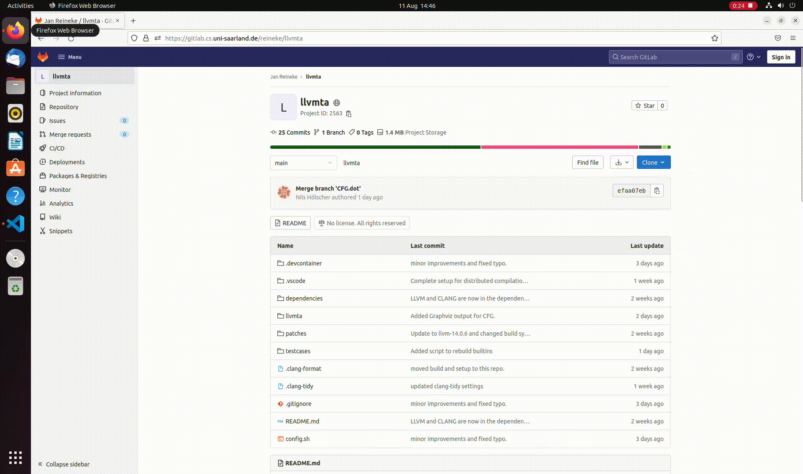

# NVM Simulation
This Repository should enable the user to use our Gem5 + NVMain2.0 setup, Unikraft and Benchmark apps to measure/evaluate NVM memory.

## Setup the repository
After cloning the repository, please make sure to execute the following in it:
```
git submodule init
git submodule update
```
This will ensure all required submodule are present and updated.

## Setup with VS Code and Docker development container
1.) Get [VS CODE](https://code.visualstudio.com/) and necessary [extensions](https://code.visualstudio.com/docs/remote/remote-overview) for remote container development.


2.) This repository supports VS code development containers. Just open the repository folder and VS code should prompt you an information that you can reopen the folder in a docker container instead. Agree and continue with [initializing](#using-the-benchmarks). Alterantivley, click the blue "Remote Window" icon in the bottom left of VS code and select "Reopen folder in container".



## Using the simulation
The NVMBench.sh script provides you with the most basic tools to setup and use Gem5/NVMain2.0/Unikraft/Benchmarks. Make sure to modify it in order to fit your needs, e.g. to setup the correct memory configuration.

### Enable / Disable features
You can decide which features to enable before building the simulation. In NVMBench.sh, transform
```
python3 `which scons` -j 8 EXTRAS=../nvmain ./build/ARM/gem5.fast
```
e.g. to
```
python3 `which scons` tu_dortmund=1 -j 8 EXTRAS=../nvmain ./build/ARM/gem5.fast
```
to enable all features from TU Dortmund.

Currently the following features are supported:
tu_dortmund: Bit-Flip Trace Writer
CDNCcim: TODO

### Build the simulation
Before running the simulation (Gem5 + NVMain2.0) it needs to be build with:
```
./NVMBench.sh fb
```
Please make sure you are in the directory NVMBench.sh is in. Alterantivly, use Ctrl+Shift+B in VS code to build the simulator.

### Prepare the benchmarks
All benchmark apps in unikraft_setup/apps/ should be configured already, however they can be configured again by using:
```
./NVMBench.sh c APPNAME
```
For more information see the Unikraft documentation.

The apps can be build with:
```
./NVMBench.sh ba APPNAME
```

### Running the simulation
Start the simulation with:
```
./NVMBench.sh e APPNAME
```
Simulation results will be dumped in the results/APPNAME.d folder.
The simulation starts detached from the terminal. The gem5 output is located in results/APPNAME.d/gem5.terminal. The unikraft terminal output is located at results/APPNAME.d/m5out/system.terminal

### TL;DR:
Execute only once after cloning the repository:
```
git submodule init
git submodule update
```

To run the simulation:
```
./NVMBench.sh fe APPNAME
```

Results are in: results/APPNAME.d/